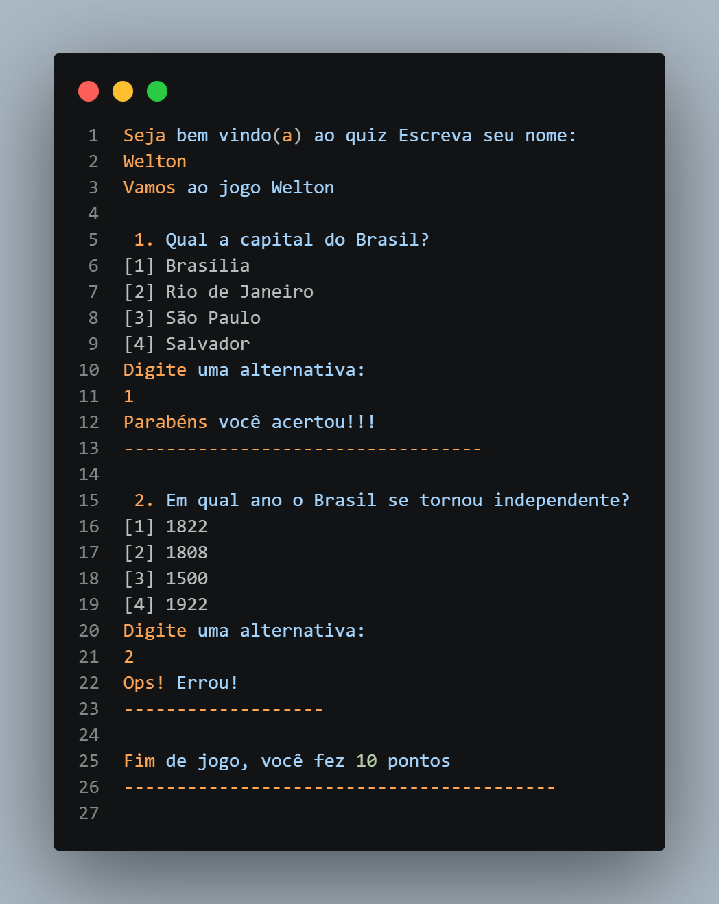

# quiz-go

## Go Lang

[Go (or Go)](https://go.dev/) is an open-source programming language created at Google, designed to be simple, fast, and efficient for building scalable software. It combines the performance of compiled languages like [C](https://www.c-language.org/) with the ease of use of higher-level languages, featuring a clean syntax, built-in concurrency through goroutines and channels, and a strong standard library. [Go](https://go.dev/) is widely used for backend development, cloud services, networking tools, and DevOps systems because it compiles quickly, produces efficient binaries, and handles multiple tasks concurrently with minimal complexity.

### game - quiz-go
**quiz-go** is a simple question and answer game where the user can choose from options and receive a score at the end. The purpose of this project is to understand the basic syntax of the [Go](https://go.dev/) language, its usability, and usage scenarios.

#### Demo


## Getting started
**Requirements:**
- [Go 1.26.0](https://go.dev/doc/install)

**Follow the steps below**
```bash
# Clone the project and access the folder
git clone https://github.com/wwwwelton/quiz-go && \
cd quiz-go

# Run the game
go run main.go

# Well done!
```

## 📝 License

This project is licensed under the GNU General Public License v3.0 - see the [LICENSE](LICENSE) file for details.

---

Made by: Welton Leite 👋 [See my linkedin](https://www.linkedin.com/in/welton-leite-b3492985/)
